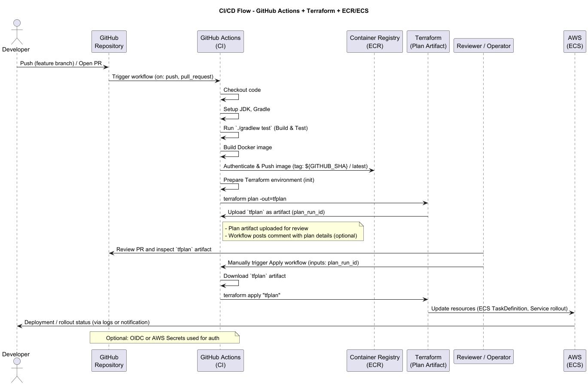
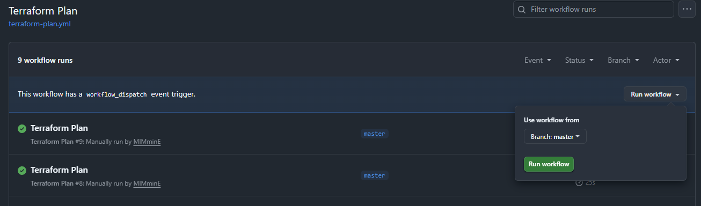
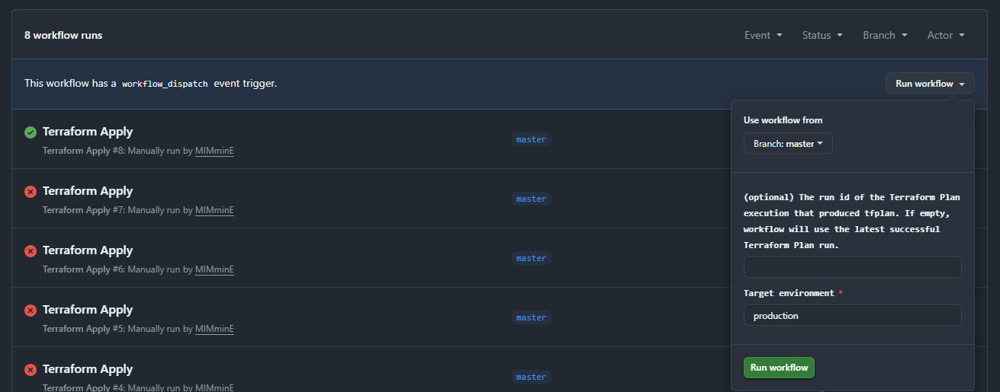

# Order Service IAC·CICD

## 간단 소개

- 저장소: `order-service-iac-cicd`
- 핵심: Spring Boot 기반의 주문/상품 서비스(`order-service`)와 Terraform + GitHub Actions를 이용한 코드 기반 인프라(IaC) 및 CI/CD 파이프라인 예제
- 주요 포인트: 이 프로젝트는 서비스 구현(비즈니스 로직) 데모도 포함하지만, 실제 포커스는 인프라 자동화 및 배포 파이프라인 설계/검증입니다.

## 목표

1. 서비스의 로컬 개발/테스트 환경을 쉽고 재현 가능하게 제공
2. Terraform을 통해 인프라(예: ECS, ECR, S3 상태 버킷 등)를 코드로 관리
3. GitHub Actions로 빌드 → 테스트 → 컨테이너 이미지 빌드/푸시 → 인프라 Plan/Apply 파이프라인 구성
4. 안전한 운영(Plan 검토 → 수동 Apply) 워크플로우 제공

## 기술 스택

- 언어/프레임워크: Kotlin, Spring Boot
- 빌드: Gradle
- 컨테이너: Docker
- IaaS: AWS (ECR, ECS, S3 등) — Terraform으로 프로비저닝
- CI/CD: GitHub Actions (`.github/workflows/`)
- 로컬 개발: Docker Compose (Postgres 로컬 DB)
- 코드 위치 요약:
    - 서비스 소스: `order-service/`
    - Terraform 구성: `infra/terraform/`
    - 로컬 compose: `infra/local/compose.yml`
    - GitHub Actions 워크플로우: `.github/workflows/`

## 빠른 실행 (로컬 개발용)

### 로컬 DB 기동 (프로젝트 루트에서):

```powershell
cd infra/local; docker compose up --build
```

- 서비스 빌드 및 테스트 (서비스 디렉터리에서):

```powershell
cd order-service; .\gradlew test
```

- 애플리케이션 실행:

```powershell
# 개발 모드
cd order-service; .\gradlew bootRun

# 또는 빌드 후 JAR 실행
cd order-service; .\gradlew bootJar; java -jar build/libs/*.jar
```

- 환경 변수(예시)
    - SPRING_DATASOURCE_URL=jdbc:postgresql://localhost:5432/orders
    - SPRING_DATASOURCE_USERNAME=postgres
    - SPRING_DATASOURCE_PASSWORD=postgres

## 서비스 주요 기능

이 프로젝트는 인증(Auth), 오더(Order), 상품(Product) 세 가지 영역을 중심으로 구성되어 있습니다. 아래는 실제 포트폴리오·문서에 쓸 수 있는 API 중심 설명입니다. 엔드포인트는 예시이며, 서비스
코드의 실제 경로(`src/main/kotlin/...`)를 확인해 필요한 경우 세부명을 맞춰 적으세요.

### 1) 인증 (Authentication)

- 목적: 사용자 인증/권한 부여 및 토큰 발급(JWT 기반 가정)
- 주요 엔드포인트:
    - POST /api/auth/register
        - 설명: 신규 사용자 가입
        - 요청 예시: { "username": "user1", "password": "P@ssw0rd" }
        - 응답 예시: { "id": 123, "username": "user1" }
    - POST /api/auth/login
        - 설명: 로그인 후 액세스 토큰(JWT) 반환
        - 요청 예시: { "username": "user1", "password": "P@ssw0rd" }
        - 응답 예시: { "accessToken": "eyJ...", "tokenType": "Bearer" }
    - GET /api/auth/me
        - 설명: 현재 인증된 사용자 정보 조회
        - 인증: `Authorization: Bearer <token>`
        - 응답 예시: { "id": 123, "username": "user1", "roles": ["ROLE_USER"] }

### 2) 오더 (Order)

- 목적: 주문 생성/조회/관리
- 주요 엔드포인트(인증 필요):
    - POST /api/orders
        - 설명: 주문 생성
        - 요청 예시:
          {
          "userId": 123,
          "items": [ { "productId": 10, "quantity": 2 } ],
          "shippingAddress": "서울시 ..."
          }
        - 응답 예시: { "orderId": 987, "status": "CREATED", "total": 45000 }
    - GET /api/orders/{orderId}
        - 설명: 주문 상세 조회 (주문자 본인 또는 관리자)
        - 응답 예시: { "orderId": 987, "items": [...], "status": "CREATED", "createdAt": "2026-03-01T12:34:56Z" }
    - GET /api/orders?userId={userId}&page=0&size=20
        - 설명: 사용자별 주문 목록 조회 (페이징)

### 3) 상품 (Product)

- 목적: 상품 조회 및 관리
- 주요 엔드포인트:
    - GET /api/products
        - 설명: 상품 리스트 조회 (검색/필터 지원)
        - 응답 예시: [ { "id": 10, "name": "노트북", "price": 1000000, "stock": 5 }, ... ]
    - GET /api/products/{id}
        - 설명: 상품 상세
    - POST /api/products (관리자 전용)
        - 설명: 상품 등록
        - 요청 예시: { "name": "신제품", "price": 100000, "stock": 50 }
        - 응답 예시: { "id": 201, "name": "신제품", "price": 100000 }

### 4) IaC & CICD



- Terraform 구성
    - 위치: `infra/terraform/`
    - 주요 목적: AWS에 필요한 리소스(ECR, ECS 클러스터, 서비스, Task Definition, S3 state bucket 등)를 코드로 관리
    - 파일 예: `main.tf`, `variables.tf`, `outputs.tf`, `versions.tf`
    - 상태 관리: S3 버킷(원격 상태)과 잠금(DynamoDB) 사용을 권장하지만, 이 프로젝트에서는 `TF_STATE_BUCKET` 시크릿을 사용하도록 구성되어 있습니다.

- GitHub Actions 워크플로우
    - 위치: `.github/workflows/`
    - 주요 워크플로우:
        - Build & Test: Gradle 빌드 및 테스트 수행 (PR/푸시)
        - Docker Build & Push: ECR에 이미지 빌드/푸시
        - Terraform Plan: PR 또는 수동으로 `terraform plan -out=tfplan` 실행 후 `tfplan`을 아티팩트로 업로드
        - Terraform Apply: 수동 트리거(운영 환경) — Plan 아티팩트를 받아 `terraform apply` 수행. `plan_run_id` 입력으로 특정 Plan run의 아티팩트를 선택
          가능
    - 인증: 이 리포지터리는 OIDC 대신 GitHub Secrets에 저장된 AWS 키(`AWS_ACCESS_KEY_ID`, `AWS_SECRET_ACCESS_KEY`, `AWS_REGION`)를 사용하도록
      구성되어 있습니다.
    - 안전성: Plan과 Apply를 분리하고, Apply는 수동 승인/검토 과정이 필요하도록 구성되어 있어 운영 리스크를 낮춥니다.

--- 


- 실제 plan 워크플로우를 수동으로 실행시키는 화면 예시입니다. Plan 단계에서는 Terraform이 인프라 변경사항을 계산해 `tfplan` 파일로 저장하며, 이 파일은 Apply 단계에서 검증된 변경만
  적용하도록 사용됩니다.
- `tfplan` 파일은 바이너리 형식이므로, 워크플로우에서는 아티팩트로 업로드해 Apply 단계에서 다운로드하여 사용하도록 구성되어 있습니다. 이렇게 하면 Plan과 Apply가 명확히 분리되고, 검증된 변경만
  실제 인프라에 반영되도록 보장할 수 있습니다.

---



- 실제 Apply 워크플로우를 수동으로 실행시키는 화면 예시입니다. Apply 단계에서는 Plan 단계에서 생성된 `tfplan` 아티팩트를 다운로드하여 `terraform apply` 명령을 실행합니다. 이
  과정에서 실제 AWS 리소스에 대한 변경이 적용되고, 리소스별 상태와 결과가 로그로 출력됩니다.
- 수동 승인 기반의 Terraform Apply는 검토된 Plan만 실제 인프라에 반영하도록 보장하며, 배포 로그와 상태는 워크플로우에서 즉시 확인할 수 있습니다.