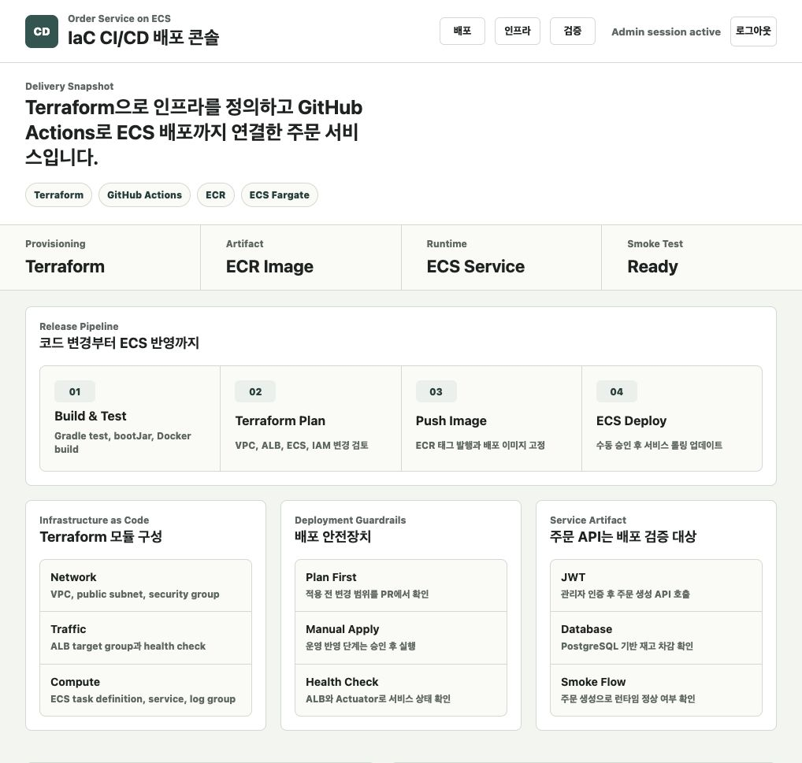
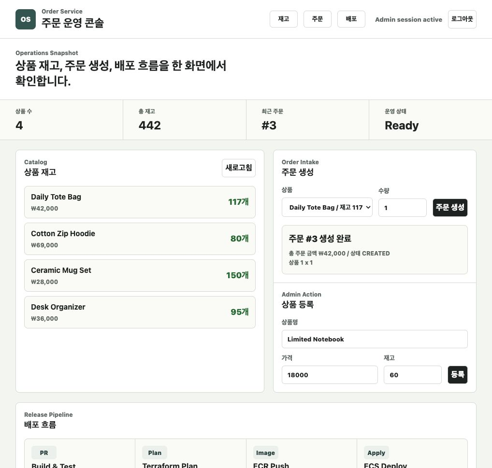
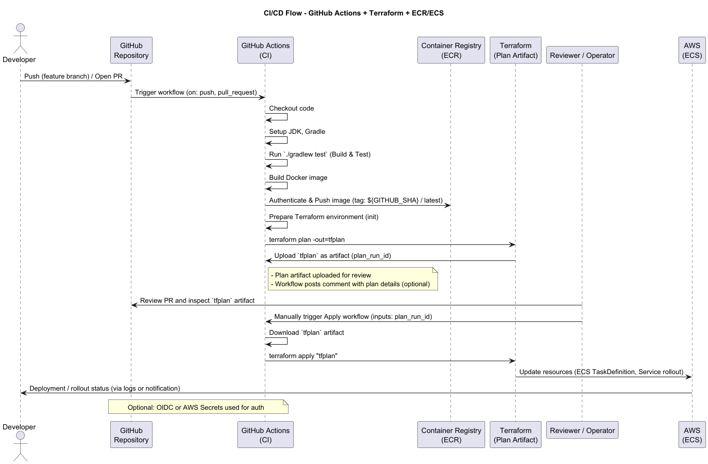

# Order Service IaC/CD Portfolio

## 소개

`order-service-iac-cicd`는 주문 서비스의 애플리케이션 코드, 컨테이너 실행 환경, Terraform 기반 인프라 구성, GitHub Actions 배포 파이프라인을 한 저장소에서 연결한 프로젝트입니다. 서비스 구현 자체보다 “주문 API를 운영 환경에 올릴 때 필요한 흐름을 어떻게 나누고 검증할 것인가”에 초점을 맞췄습니다.





## 화면 기획

로컬 웹 콘솔은 API 호출 결과를 단순히 나열하기보다, 운영자가 확인할 법한 세 가지 정보를 한 화면에 배치했습니다.

- 상품 수, 총 재고, 최근 주문 같은 빠른 상태 지표
- 상품별 가격과 재고를 확인하는 카탈로그 영역
- 주문 생성과 상품 등록을 바로 실행하는 운영 액션 영역
- 배포 흐름을 함께 보여주는 CI/CD 파이프라인 요약

이 화면은 Spring Boot의 정적 리소스로 제공되며, 별도 프론트엔드 서버 없이 `docker compose up --build -d` 후 `http://localhost:18082`에서 확인할 수 있습니다.

## 핵심 구현

- `POST /auth/login`: 관리자 JWT 발급
- `GET /products`: 상품 목록 조회
- `POST /products`: 관리자 권한 상품 등록
- `POST /orders`: 주문 생성 및 재고 차감
- `GET /orders/{orderId}`: 주문 상세 조회

주문 생성 시 같은 상품에 대한 동시 요청이 들어와도 재고가 음수가 되지 않도록 `ProductRepository.findByIdForUpdate()`에서 `PESSIMISTIC_WRITE` 락을 사용합니다.

## 인프라와 배포



- Build & Test: PR/푸시 시 Gradle 테스트 수행
- Docker Build & Push: 이미지를 빌드하고 ECR에 푸시
- Terraform Plan: 인프라 변경 사항을 plan artifact로 저장
- Terraform Apply: 검토된 plan artifact를 수동 실행으로 적용

Plan과 Apply를 분리해 운영 반영 전에 변경 내용을 검토할 수 있게 구성했습니다.

## 로컬 실행

```bash
cd order-service
docker compose up --build -d
```

| Target | URL |
| --- | --- |
| Web Console | http://localhost:18082 |
| Health Check | http://localhost:18082/actuator/health |
| PostgreSQL | localhost:15435 |

관리자 계정은 로컬 실행 시 `admin@orders.local / password123`로 자동 생성됩니다.
